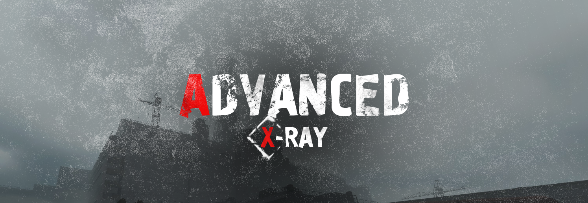

# Advanced X-Ray

  

    
  

 [M.F.S. Team](https://vk.com/mfs_studio)
 [Discord Server](https://discord.gg/AFPqkfBfQs)

Advanced X-Ray - A complete modding platform for the S.T.A.L.K.E.R. trilogy, based on the X-Ray 1.6 engine. Delivers essential bug fixes from the original engine, enhanced stability, and comprehensive tools for mod creation. Fully supports Shadow of Chernobyl, Clear Sky, and Call of Pripyat.

## Supported games

|Call of Pripyat|Clear Sky|Shadow of Chernobyl|
|---|---|---|
|Yes|Yes|Yes|

## Supported renders

|DX9|DX10|DX11|
|---|---|---|
|Yes|No|Yes|

## Build status

|Platform|Configurations|
|---|---|
|Windows|Debug / Mixed / Release (x64)|

## How to Build

- Install Visual Studio 2022
- Open engine.sln
- Build solution

## Latest version

Check out the latest release [here](https://github.com/DanceManiac/Advanced-X-Ray-Public/releases/latest).

## Documentation

- [Changelog](https://github.com/DanceManiac/Advanced-X-Ray-Public/wiki/Changelog)
- [Wiki](https://github.com/DanceManiac/Advanced-X-Ray-Public/wiki)
- [License](./LICENSE.md)

## Thanks

- [OpenXRay](https://github.com/OpenXRay/xray-16)
- [OGSR Engine](https://github.com/OGSR/OGSR-Engine)
- [Shoker Weapon Mod](https://github.com/ShokerStlk/xray-16-SWM)
- [Call of Chernobyl](https://github.com/revolucas/CoC-Xray)
- [Lost Alpha](https://www.moddb.com/mods/lost-alpha)
- [ForserX](https://github.com/ForserX)
- [Xottab_DUTY](https://github.com/Xottab-DUTY)
- [Abramcumner](https://github.com/abramcumner)
- [LVutner](https://github.com/LVutner)
- [sodat1de](https://github.com/sodat1de)
- [Mortan](https://github.com/mortany)
- [RedProjects](https://github.com/RedPandaProjects)
- [xrLil Batya](https://github.com/xrLil-Batya)
- [Anomaly](https://github.com/Roman-n/xray-monolith)
- [Hrusteckiy](https://github.com/Hrusteckiy)
- [ValeroK](https://github.com/VaIeroK)
- [IX-Ray Team](https://github.com/ixray-team)
- [Graff46](https://github.com/Graff46)
- [CoC-Xray](https://github.com/revolucas/CoC-Xray)
- [v2v3v4](https://github.com/v2v3v4)
- [yohjimane](https://github.com/yohjimane)
- [joye-ramone](https://github.com/joye-ramone)
- [xrSimpodin](https://github.com/xrSimpodin)
- [PRXPHET](https://github.com/PRXPHET)
- [VlaGan](https://github.com/VlaGan)
- [I-AmDead](https://github.com/I-AmDead)
- [PilotOfTheHighestSeniority](https://github.com/PilotOfTheHighestSeniority)
- [dsh2dsh](https://github.com/dsh2dsh)
- [Desert Cliff](https://github.com/mrGlock5)
- [solbjorn](https://github.com/solbjorn)
- [CeasarLFO](https://github.com/CeasarLFO)
- [yuriks](https://github.com/yuriks)
- [Screen Space Shaders](https://www.moddb.com/mods/stalker-anomaly/addons/screen-space-shaders)
- [Enhanced Shaders and Color Grading](https://www.moddb.com/mods/stalker-anomaly/addons/enhanced-shaders-and-color-grading-for-151)
- NS OGSR
- DWM Team
- CorryZeron
- Oxygen Engine
- Lex Addon

Sorry if I forgot someone. Write to [VK](https://vk.com/mfs_studio) of [Discord](https://discord.gg/AFPqkfBfQs) and I'll add it.
